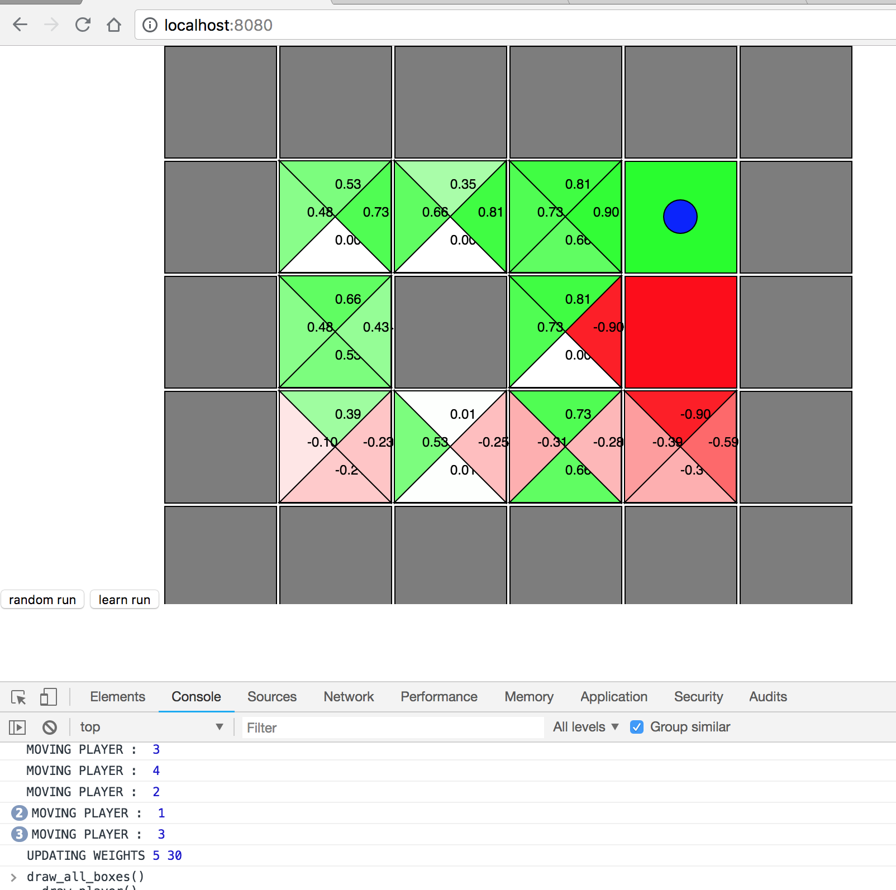

# ReinforcementLearning-Gridworld

This repo contains a HTML version of the Gridworld, Which is the Basic environment for Reinforcement Learning.

# Usage

```
git clone https://github.com/Shivakishore14/ReinforcementLearning-Gridworld.git
cd ReinforcementLearning-Gridworld

# serve the folder using any static server
python -m SimpleHTTPServer 8080
```

# ScreenShot


